# Запуск 
```bash
python3 data_split.py --csv_path /data/shopee-product-matching/train.csv
```
Обучение модели
```bash
python3 train_model.py
```

Валидация модели
```bash
python3 validate_model.py
```


# Аугментации
В качестве аугментаций используется:
```
* transforms. - аугментация из стандартной библиотеки торча torchvision
  mytransforms. - аугментации реализованные самостоятельно в lib.transforms
``` 

- `transforms.RandomHorizontalFlip`

  Случайные повороты картинок.
  
  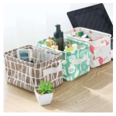  

- `mytransforms.RandomWatermark`

  Случайное добавление вотермарки, может быть иконка или лого компаний.
  
  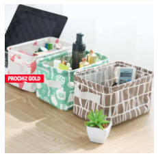  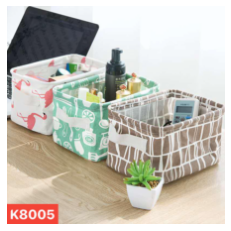
  
  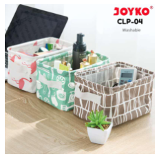  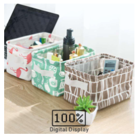

- `mytransforms.RandomText`

  Добавление случайного текста, разного размера, разных шрифтов.
  
  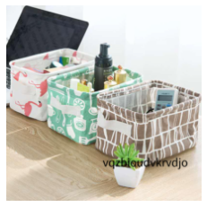  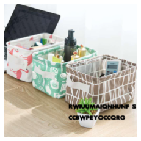
  
  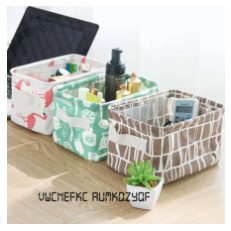  


- `mytransforms.RandomBound`

  Добавление границы.
  
  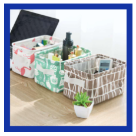  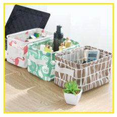
  

- `transforms.Resize`

  Изменение разрешения изображения.
 

- `mytransforms.RandomResizeWithPad`
   
  Уменьшение размера картинки с педдингом выбранным значением, до исходного размера.
  
  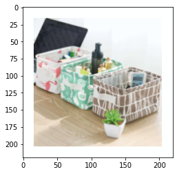  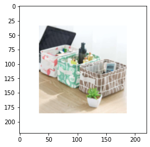
  

# Семплирование

В каждом батче содержится `n_classes`, число уникальных лейблов в нем и `n_samples`, сколько 
представителей этого класса взять в батч. Если представителей лейбла не хватает в выборке, то 
используется стратегия *over_sampling* и картинки берутся из уже существующих, в итоге 
все картинки получаются разные, так как у каждой своя аугментация.

Пример Батча после аугментации:

   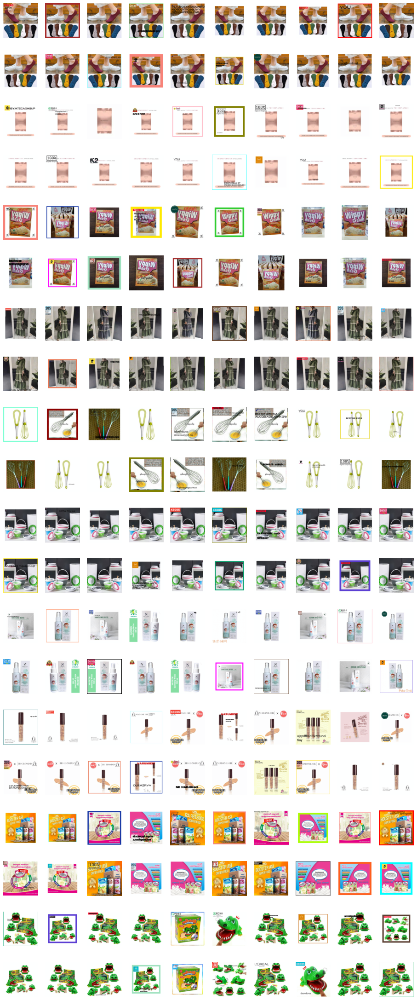


# Генерация триплетов


Примеры получившихся триплетов:

   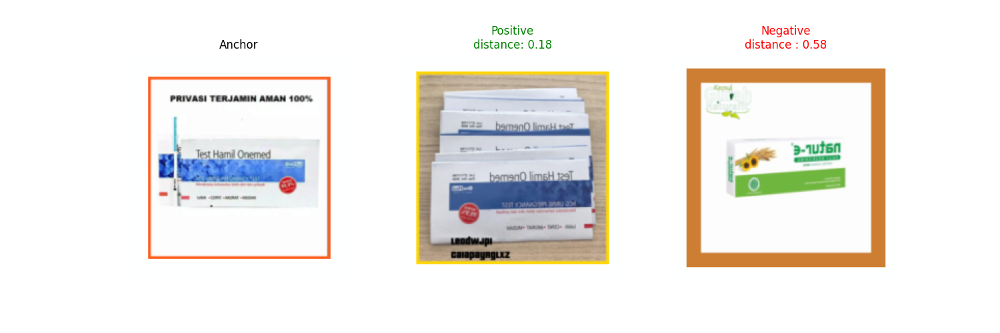
    
   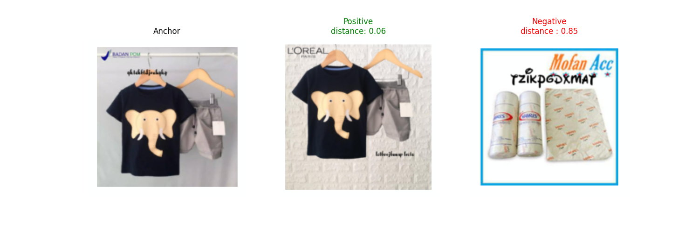
    
   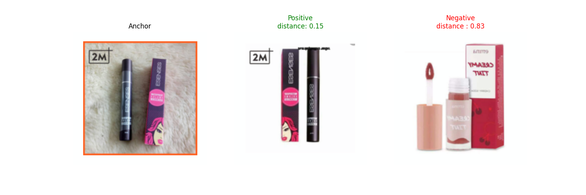
   
 
# Архитектуры моделей